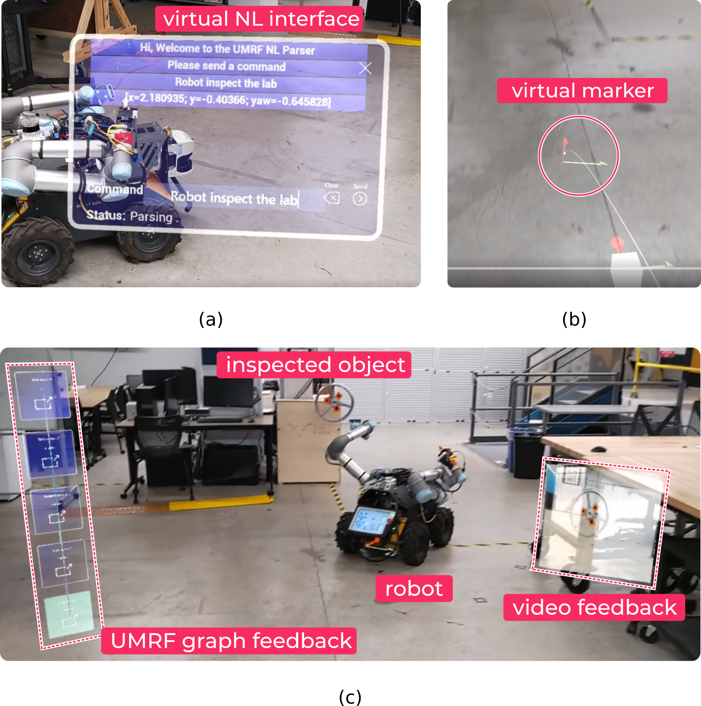

# Multimodal Resolution AR

This repository contains the code and resources for the demonstration of Large Language Model (LLM) driven task planning for Embodied AI (EAI) systems, using Augmented Reality AR headsets (HoloLens 2) for human-robot teaming.
The multi grounding technique combines voice commands and interactive interfaces via Virtual Markers.

## Requirements: 

* [Unreal Engine 4.26](https://www.unrealengine.com/en-US)
* [Robofleet Server](https://github.com/UTNuclearRobotics/robofleet.git) on your local network.
  * System that enables ROS-based robot-to-robot communication.
* [Azure Spatial Anchor Account](https://azure.microsoft.com/en-us/services/spatial-anchors/)
  * Built in Microsoft feature to allows HoloLens and Robots co-localize with each other.
* [GPT to UMRF parser node](https://github.com/temoto-framework/gpt_umrf_parser/tree/demo_test) 
  * Node that receives NL commands, sends a request to a GPT model and provides the output as UMRF Graphs.
* [TeMoto](https://github.com/temoto-framework/temoto)
  * Framework used to control the execution flow of robotic tasks.
* [TeMoto Config Package](https://github.com/temoto-framework-demos/gpt_temoto_demo.git)
  * Repository that contains the Temoto config package with a set of TeMoto Actions that the robot can execute

[<br/>](https://github.com/UTNuclearRoboticsPublic/multimodal_resolution_ar/blob/main/Demo%20Setup.png) 

## Usage
1. Clone the Repo
 ```sh
 git clone --recursive https://github.com/UTNuclearRoboticsPublic/multimodal_resolution_ar.git
 ```    
2. Generate the solution
3. Package the project and deploy to the HoloLens Device

Find mode documentation on how to run and deploy apps using Unreal engine [here](https://learn.microsoft.com/en-us/windows/mixed-reality/develop/unreal/unreal-quickstart)

# Run the Demo

## Robot Side: 
Terminal 1
``` bash
# Start TeMoto Framework
roslauch vaultbot_temoto_config temoto.launch
```

Terminal 2 
``` bash
# Bring up the robot
roslaunch ta_initialize_robot invoke_action.launch wake_word:=vaultbot_temoto_config
# Run the node that provides the execution state of current UMRF Graphs
roslaunch ta_get_action_state invoke_action.launch wake_word:=vaultbot_temoto_config
```
> Note: Make sure you find an anchor frame and it is part of the TF tree. Drive the robot and verify it is correctly localize in the map 


Terminal 3
``` bash 
# Export the key as an environment variable
export GPT_API_KEY=$(cat <path/to/openai_key>)

# Invoke the parser node
rosrun gpt_umrf_parser gpt_umrf_parser_node.py -ue umrf_examples/
```
At this point the robot is up and ready to receive commands. 

## HoloLens:
* Start the 'multimodal_resolution_ar' app on the HoloLens
* Walk around and make sure to find an anchor before send commands. This is the common frame between hololens and robots.
* Open the TeMoto interface 
  * You can use the hand menu and tap on top of the TeMoto Icon, or use the keyword "TeMoto" voice command to open the chat-like interface. 
A coordinate system and a chat window will appear. Place the coordinate frame at a desire location, for this you can use near or far interactios using hand gestures.

* Use the chat-style interface to send a command. You can type the request or send a voice command using the microphone from the keyboard i.e. "robot inspect that area". (a)

The HoloLens uses visual marker information (b) and voice commands to generate a prompt in a string format, which is then sent to the gpt_parser_node through the `/command` topic. The node appends a few examples to the prompt and sends the request to the GPT model. It takes some time for the model to generate an output, and once it is ready, a sequence of blocks is spawned on the HoloLens, representing the UMRF Graph as feedback, with a combination of `navigation`, `manipulation`, and `take_photo` actions. The robot should start executing the graph. Each block is highlighted with a different color based on the state of execution. (c)

[<br/>](https://github.com/UTNuclearRoboticsPublic/multimodal_resolution_ar/blob/main/Demo%20Setup.png)

